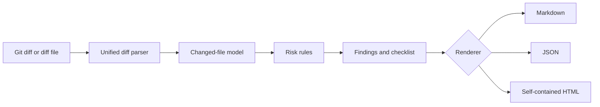

# 🔍 ReviewForge

**Offline-first pull request risk analysis and code-review report generation in Rust.**

[](https://github.com/Hirakhyzer/reviewforge/actions/workflows/ci.yml)

ReviewForge reads a standard unified Git diff and produces a structured Markdown, JSON, or interactive HTML report. It helps reviewers find high-risk files, missing test changes, dependency edits, CI permission changes, and large review surfaces—without uploading source code to a service.

> ReviewForge provides review heuristics, not proof of correctness or security. A human reviewer remains responsible for the decision.

## Why build it?

| Problem | ReviewForge response |
|---|---|
| Large diffs are hard to prioritize | Per-file and overall risk scores |
| Reviewers forget recurring checks | Generated reviewer checklist |
| Source changes may lack test updates | Test-gap heuristic |
| CI, auth, migration, and dependency changes deserve attention | Critical-path detection |
| Private code should remain private | Local processing; no network dependency |
| Reports need to fit different workflows | Markdown, JSON, and self-contained HTML |

## Quick start

```bash
cargo run -- analyze --diff examples/sample.diff
```

Generate a visual report:

```bash
cargo run -- analyze \
  --diff examples/sample.diff \
  --format html \
  --output review-report.html \
  --context "Fixes #42"
```

Analyze the current Git change:

```bash
git diff origin/main...HEAD | cargo run -- analyze --format markdown
```

See the committed [sample HTML report](docs/sample-report.html) for the visual output.

## Example output

```text
Risk: 72 / 100 (high)
3 files changed with 8 additions and 3 deletions.

Findings
- No test changes detected
- Potentially risky construct added

Reviewer checklist
- Validate critical-path behavior in src/auth/session.rs
- Verify CI permissions, triggers, and secret usage
- Review dependency provenance and version changes
```

## Architecture



The v0.1 engine is dependency-free and uses Rust's standard library only.

## Risk signals in v0.1

- Changed-line and hunk volume
- Auth, security, payments, migrations, deployment, and infrastructure paths
- Dependency and lock files
- CI workflow changes
- Deleted files and deleted test files
- Production source changed without test-file changes
- Large pull request surface
- A small set of explicitly risky constructs

Scoring is deliberately explainable: every file score includes human-readable reasons.

## Commands

```text
reviewforge analyze --diff changes.diff
reviewforge analyze --format json
reviewforge analyze --format html --output report.html
reviewforge analyze --context "Fixes #12 and #44"
```

Run `reviewforge --help` for all options.

## Development

```bash
cargo fmt --all --check
cargo clippy --all-targets
cargo test
```

## Roadmap

| Version | Goal |
|---|---|
| 0.1 | Diff parsing, risk model, findings, Markdown/JSON/HTML |
| 0.2 | Configurable policy rules and repository profiles |
| 0.3 | GitHub/GitLab annotations and SARIF output |
| 0.4 | Ownership mapping and reviewer suggestions |
| 0.5 | Semantic adapters for Rust, Python, TypeScript, and Go |

See [docs/ROADMAP.md](docs/ROADMAP.md) for details.

## Contributing

Small, explainable rules with regression tests are preferred. See [CONTRIBUTING.md](CONTRIBUTING.md).

## License

MIT
